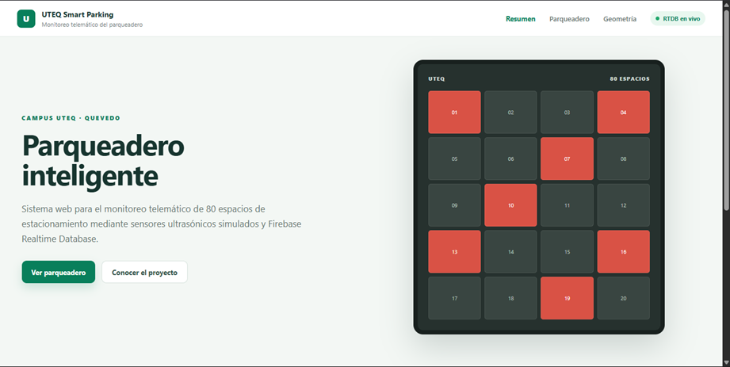
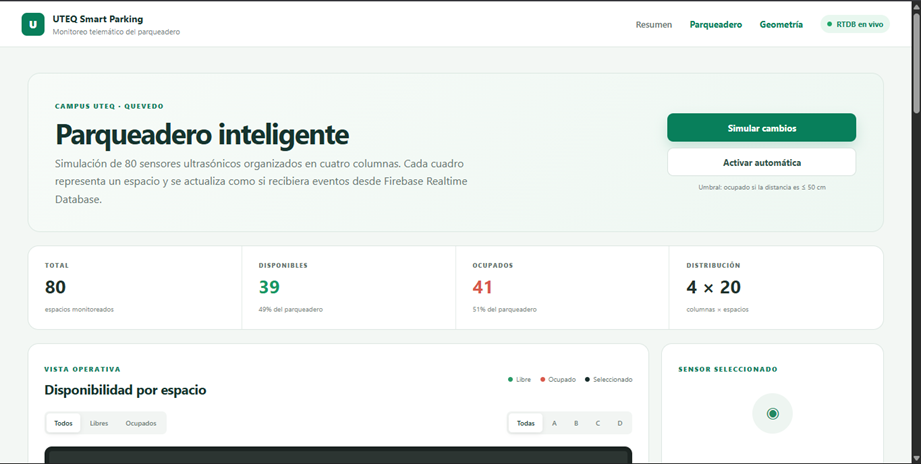
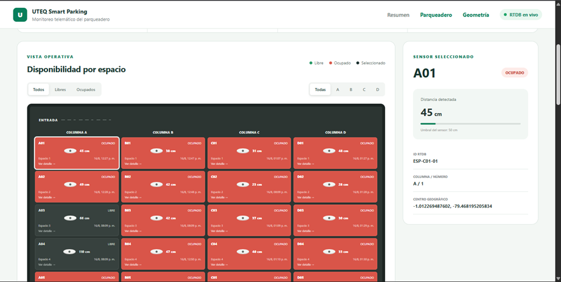
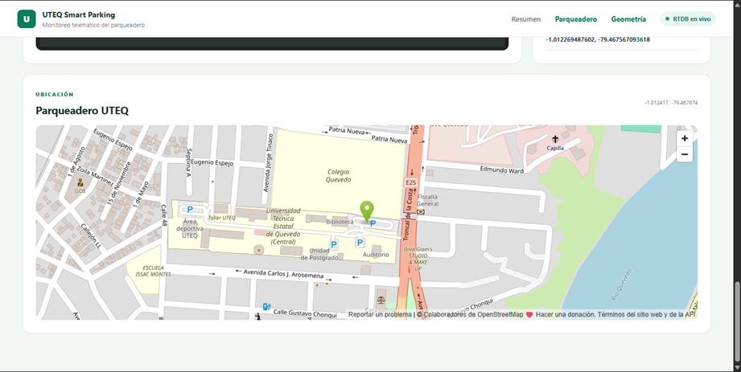
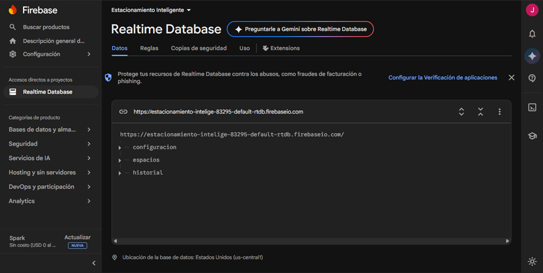
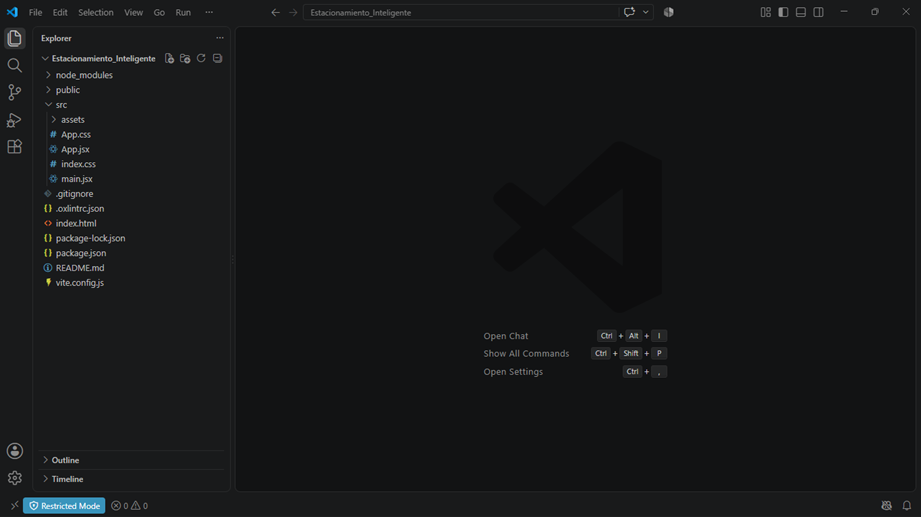

# 🅿️ UTEQ Smart Parking — Estacionamiento Inteligente

**Sistema web de monitoreo telemático para un estacionamiento inteligente en la Universidad Técnica Estatal de Quevedo (UTEQ).**


---

## 📖 Descripción del proyecto

**UTEQ Smart Parking** es una aplicación web desarrollada en **React** que simula el funcionamiento de un estacionamiento inteligente ubicado dentro del campus de la UTEQ. El sistema está compuesto por **80 espacios de estacionamiento**, distribuidos visualmente en **4 columnas de 20 espacios cada una**.

Cada espacio está asociado a un **sensor ultrasónico simulado** que envía información en tiempo real a **Firebase Realtime Database (RTDB)**, reportando la distancia detectada, el estado del espacio (libre u ocupado) y la fecha/hora de la medición. La aplicación consulta esta información en vivo y la representa gráficamente mediante una cuadrícula interactiva de colores.

## 🎯 Finalidad del proyecto

Este proyecto nace como una solución al problema cotidiano de **no saber qué espacios de un estacionamiento están disponibles**, lo que genera pérdida de tiempo y congestión vehicular dentro del campus. La propuesta plantea un modelo de **estacionamiento inteligente (Smart Parking)** que, mediante sensores de distancia (simulados en esta etapa del proyecto), permite conocer en tiempo real la disponibilidad de cada espacio.

Con esta aplicación se busca:

- 🚗 Demostrar cómo un sistema **IoT + aplicación web en tiempo real** puede optimizar el uso del espacio físico de un estacionamiento universitario.
- 📡 Aplicar el uso de **Firebase Realtime Database** como backend para sincronización de datos en vivo entre múltiples sensores y clientes.
- 🎓 Servir como **proyecto académico/prototipo** que aplica conceptos de desarrollo web con React, geolocalización, visualización de datos y arquitectura orientada a componentes.
- 🔧 Sentar las bases para una futura implementación con **sensores ultrasónicos reales** conectados por hardware (ESP32/Arduino) al mismo backend de Firebase.

## ✨ Características principales

- ✅ Conexión en tiempo real a **Firebase Realtime Database**.
- ✅ Cuadrícula visual de **80 espacios** (4 columnas × 20 espacios).
- ✅ Código de colores: 🟢 Libre · 🔴 Ocupado · ⚪ Sin información.
- ✅ Tarjetas de resumen: total, disponibles, ocupados y porcentaje de disponibilidad.
- ✅ Filtros por **columna** (A, B, C, D) y por **estado** (libres/ocupados).
- ✅ Vista de **detalle por espacio** con historial de cambios.
- ✅ **Mapa** con la ubicación georreferenciada del parqueadero.
- ✅ **Simulación automática y manual** de cambios en los sensores.

## 🖼️ Capturas de pantalla

### 🏠 Página de inicio
Presenta la descripción del proyecto y el acceso directo al módulo del estacionamiento.



### 📊 Página del parqueadero — Resumen
Tarjetas con estadísticas en vivo (total, disponibles, ocupados, distribución 4×20) y controles de simulación.



### 🧭 Página del parqueadero — Cuadrícula de espacios
Vista operativa con los 80 espacios organizados por columnas (A, B, C, D), estado, distancia detectada y panel de detalle del sensor seleccionado.



### 🗺️ Ubicación del parqueadero
Mapa interactivo con la ubicación real del parqueadero dentro del campus de la UTEQ.



### 🔥 Firebase Realtime Database
Estructura de datos en vivo del proyecto, con los nodos `configuracion`, `espacios` e `historial`.



### 🧩 Estructura del proyecto en VS Code
Organización del código fuente del proyecto (Vite + React).



## 📍 Ubicación del estacionamiento

El área del parqueadero está delimitada por las siguientes coordenadas dentro del campus UTEQ:

| Punto | Latitud | Longitud |
|-------|---------------------|---------------------|
| P1 | -1.0122617572453996 | -79.4682858877737 |
| P2 | -1.0125032549290254 | -79.4682998912032 |
| P3 | -1.0125709715003960 | -79.46748620024898 |
| P4 | -1.0123403901396444 | -79.46746240847104 |

**Bounding box general aproximado:**

```json
{
  "norte": -1.0122617572453996,
  "sur": -1.012570971500396,
  "oeste": -79.4682998912032,
  "este": -79.46746240847104
}
```

## 📐 Cálculo aproximado del espacio

A partir de las coordenadas del terreno se calculó:

| Medida | Valor |
|---|---|
| Largo promedio | 91.37 m |
| Ancho promedio | 26.34 m |
| Área aproximada | 2405.74 m² |
| Ancho por columna | 6.58 m |
| Largo por espacio | 4.57 m |
| Superficie por celda | 30.08 m² |

Dentro de cada celda se representa un espacio de estacionamiento aproximado de **2.50 m × 5.00 m**, dejando el resto del área para calles de circulación y separación.

## 🧠 Lógica de determinación del estado

El estado de cada espacio se calcula a partir de la distancia detectada por el sensor:

```js
const estado = distanciaDetectada <= 50 ? 'ocupado' : 'libre';
```

- **Distancia ≤ 50 cm** → 🔴 Ocupado.
- **Distancia > 50 cm** → 🟢 Libre.

## 🗄️ Estructura de datos en Firebase RTDB

```json
{
  "espacios": {
    "ESP-C01-01": {
      "id": "ESP-C01-01",
      "columna": 1,
      "numero": 1,
      "distanciaDetectada": 135.4,
      "estado": "libre",
      "fechaHora": 1786676400000,
      "ubicacion": {
        "latitud": -1.012270,
        "longitud": -79.468280,
        "boundingBox": {
          "norte": -1.012261,
          "sur": -1.012302,
          "oeste": -79.468299,
          "este": -79.468240
        }
      }
    }
  },
  "historial": {
    "ESP-C01-01": {
      "1786676100000": {
        "distanciaDetectada": 38.5,
        "estado": "ocupado",
        "fechaHora": 1786676100000
      },
      "1786676400000": {
        "distanciaDetectada": 135.4,
        "estado": "libre",
        "fechaHora": 1786676400000
      }
    }
  }
}
```

Cada sensor registra: **ID único**, **columna** (1–4), **número de espacio** (1–20), **bounding box**, **latitud/longitud central**, **distancia detectada (cm)**, **estado**, **fecha/hora** de medición y **ubicación/descripción**.

## 🧩 Estructura del proyecto

```
src/
├── components/
│   ├── ResumenEstacionamiento.jsx
│   ├── CuadriculaEstacionamiento.jsx
│   ├── EspacioCard.jsx
│   ├── FiltrosEspacios.jsx
│   ├── HistorialEspacio.jsx
│   └── MapaEstacionamiento.jsx
├── hooks/
│   ├── useEspacios.jsx
│   └── useHistorialEspacio.jsx
├── pages/
│   ├── Inicio.jsx
│   ├── Estacionamiento.jsx
│   └── DetalleEspacio.jsx
├── services/
│   └── firebase.js
└── App.jsx
```

## 📄 Páginas de la aplicación

| Página | Ruta | Contenido |
|---|---|---|
| **Inicio** | `/` | Descripción del proyecto y acceso al módulo de estacionamiento. |
| **Estacionamiento** | `/parqueadero` | Tarjetas de estadísticas, cuadrícula de 80 espacios, filtros por columna/estado, leyenda de colores y mapa de ubicación. |
| **Detalle del espacio** | `/espacios/:id` | Identificación, columna/número, estado actual, distancia detectada, ubicación, bounding box, fecha de actualización y tabla/gráfico de historial. |

## 🔄 Simulación de sensores

La aplicación incluye una función de simulación que genera los 80 espacios iniciales y actualiza periódicamente algunos sensores de forma aleatoria, modificando:

- Distancia detectada.
- Estado (libre/ocupado).
- Fecha y hora de la medición.
- Registro histórico del espacio.

La simulación mantiene un equilibrio entre espacios libres y ocupados, evitando que todos los sensores reporten el mismo estado al mismo tiempo.

## 🛠️ Tecnologías utilizadas

- **React** — construcción de la interfaz y componentes.
- **Vite** — entorno de desarrollo y bundler.
- **Firebase Realtime Database** — almacenamiento y sincronización de datos en tiempo real.
- **Mapas geolocalizados** (OpenStreetMap) — visualización de la ubicación del parqueadero.

## 🚀 Instalación y ejecución

```bash
# Clonar el repositorio
git clone https://github.com/<tu-usuario>/uteq-smart-parking.git
cd uteq-smart-parking

# Instalar dependencias
npm install

# Configurar variables de entorno de Firebase (.env)
VITE_FIREBASE_API_KEY=tu_api_key
VITE_FIREBASE_DATABASE_URL=https://tu-proyecto-default-rtdb.firebaseio.com

# Ejecutar en modo desarrollo
npm run dev
```

## 👨‍💻 Autor

Proyecto académico desarrollado para la **Universidad Técnica Estatal de Quevedo (UTEQ)** — Campus Quevedo.

## 📄 Licencia

Este proyecto se distribuye con fines educativos. Puedes adaptarlo según la licencia que prefieras (por ejemplo, MIT).
